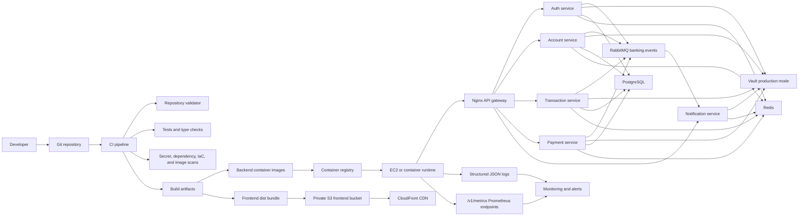

# VaultBank DevSecOps Approach

## Target posture

The current EC2 deployment is a development/POC environment until production
controls are enabled. The production target is:

- Build every NestJS service as an immutable container image.
- Serve the React frontend from private S3 through CloudFront.
- Use Vault production mode with TLS, persistent storage, AppRole, and auto
  unseal.
- Keep secrets out of Git, images, logs, and CI output.
- Block releases when tests, dependency scans, secret scans, image scans, or
  infrastructure validation fail.
- Emit structured logs, audit events, health checks, and Prometheus metrics for
  every deployable service.

## Implementation phases

| Phase | Goal | Required gates |
| --- | --- | --- |
| 1 | Repository readiness | service map, Dockerfiles, health, metrics, secret scan |
| 2 | CI security baseline | unit tests, build, lint/typecheck, dependency audit, SBOM |
| 3 | Container security | image scan, non-root runtime, signed image, pinned base images |
| 4 | Infrastructure security | Terraform plan, policy checks, private frontend bucket, production Vault |
| 5 | Release and monitoring | deployment approval, smoke tests, metrics, audit logs, alerts |

## Dataflow Diagram

## Recommended pipeline gates

1. Validate repository shape with `ci/scripts/validate-repository.sh`.
2. Build backend with `npm run build:all` from `backend-service`.
3. Build frontend with `npm run build` from `frontend`.
4. Run dependency and secret scans before image publishing.
5. Build one image per backend service using the shared Dockerfile and
   `SERVICE_NAME`.
6. Scan images before pushing to the registry.
7. Apply Terraform through reviewed plans only.
8. Deploy to staging, run smoke checks on `/health/*` and `/metrics/*`, then
   promote to production after approval.
